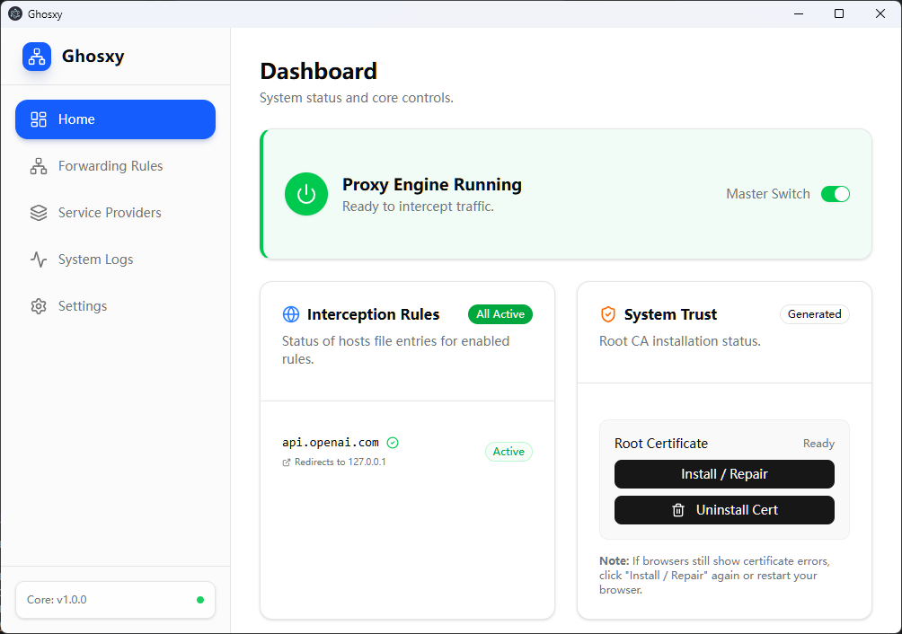

# Ghosxy

> [English Version](./README_EN.md) | 中文版

**Ghosxy** 是一个现代化的、可高度定制的本地优先 **AI 流量拦截与转发器**。

它作为一个专门针对 LLM API 流量设计的中间人(MITM)代理工具,通过动态生成 SSL 证书并修改系统 Hosts 文件,Ghosxy 能够无缝拦截发往 OpenAI、Anthropic、Gemini 等 LLM API 服务商的请求,并将其智能路由到你本地的模型(如 Ollama, LM Studio)或其他自定义的 API 渠道。

> **注意:** 本工具需要修改系统网络设置(Hosts 文件)并安装根证书。请务必阅读底部的 [免责声明](#免责声明)。

---

## ✨ 核心特性

- **🔒 HTTPS 解密拦截**:内置基于 `node-forge` 的动态证书生成引擎,可解密并分析加密的 SSL 流量
- **🔀 智能路由系统**:
  - **基于 SNI 的路由**:根据客户端请求的域名(Hostname)自动识别并分流
  - **模型映射 (Model Mapping)**:支持实时修改请求体,例如将发往 `gpt-4` 的请求透明转换为 `llama3-70b`
- **🛠 深度系统集成**:
  - **自动化 Hosts 管理**:自动注入/清理指向 `127.0.0.1` 的 Hosts 映射(支持 IPv4/IPv6 双栈)
  - **根证书管理**:提供一键安装/卸载根证书(Root CA)到系统信任库的功能(Windows/macOS/Linux)
- **🔌 多渠道支持**:统一管理多个上游服务商(OpenAI, Anthropic, 自定义本地 LLM 等)
- **📊 实时日志控制台**:内置终端风格的日志查看器,支持实时监控流量状态、错误信息及转发详情
- **🎨 现代化 UI**:基于 React 19、Shadcn UI 和 Tailwind CSS 4 构建。完美支持 **深色/浅色 (Dark/Light)** 主题切换
- **🌍 国际化支持**:原生支持 英文 (English) 和 简体中文,基于 i18next 实现

---

## 📸 界面预览



|    仪表盘 (Dashboard)    | 转发规则 (Forwarding Rules)  |
| :----------------------: | :--------------------------: |
|                          |                              |
| _系统状态概览与快捷开关_ | _配置流量拦截与模型映射逻辑_ |

| 服务提供商 (Providers) | 实时日志 (Real-time Logs) |
| :--------------------: | :-----------------------: |
|                        |                           |
|  _管理上游 API 渠道_   |     _流量调试与监控_      |

---

## 🛠 技术栈

### 核心框架

- **运行时**: [Electron](https://www.electronjs.org/) 38.1.2 (多进程架构)
- **前端**: React 19.2.0, TypeScript 5.9.2
- **UI 组件**: [Shadcn UI](https://ui.shadcn.com/) + Radix UI
- **样式**: Tailwind CSS 4.1.17, Lucide Icons, class-variance-authority
- **构建工具**: [Electron-Vite](https://electron-vite.org/) 4.0.1, Vite 7.1.6

### 核心依赖

- **代理服务**: `http-proxy` 1.18.1 - 高性能 HTTP/HTTPS 流量转发
- **PKI 基础设施**: `node-forge` 1.3.1 - SSL 证书生成与签名
- **系统集成**: `sudo-prompt` 9.2.1 - 提权执行系统级操作
- **数据持久化**: `electron-store` 8.2.0 - 本地配置管理
- **日志系统**: `electron-log` 5.4.3 - 文件日志与控制台输出
- **国际化**: `i18next` 25.6.3 + `react-i18next` 16.3.5
- **主题系统**: `next-themes` 0.4.6 - 深色/浅色模式切换

### 开发工具

- **代码规范**: ESLint 9 + Prettier 3
- **类型检查**: TypeScript (strict mode)
- **打包工具**: electron-builder 25.1.8

---

## 🚀 快速开始

### 环境要求

- **Node.js**: v18.0.0 或更高版本(推荐 LTS)
- **包管理器**: npm 或 pnpm
- **操作系统**: Windows 10/11, macOS 10.13+, Linux (实验性支持)
- **权限要求**: 需要管理员/root 权限用于修改 Hosts 文件和安装证书

### 安装步骤

1.  **克隆仓库**

    ```bash
    git clone https://github.com/your-username/ghosxy.git
    cd ghosxy
    ```

2.  **安装依赖**

    ```bash
    npm install
    ```

3.  **启动开发服务器**

    ```bash
    # 注意:在 Windows 上,建议以"管理员身份"运行终端,
    # 以便在开发过程中有权限修改 Hosts 文件。
    npm run dev
    ```

4.  **类型检查**

    ```bash
    npm run typecheck
    ```

5.  **代码格式化**

    ```bash
    npm run format
    npm run lint
    ```

6.  **构建生产版本**

    ```bash
    npm run build
    ```

7.  **打包为可执行文件**

    ```bash
    npm run build:win   # Windows (.exe)
    npm run build:mac   # macOS (.dmg)
    npm run build:linux # Linux (.AppImage)
    ```

---

## 📖 使用指南

### 初次配置

1.  **安装并信任根证书**:
    - 在 **仪表盘 (Dashboard)** 页面找到"系统信任"卡片
    - 点击 **"安装到系统信任库" (Install to System Trust)**
    - 系统会弹出权限请求对话框,点击"是"授予权限
    - 这是让浏览器和客户端信任代理拦截的关键步骤

2.  **添加服务提供商**:
    - 进入 **服务提供商 (Providers)** 页面
    - 点击"添加提供商"按钮
    - 配置示例:
      - **名称**: My Local Ollama
      - **类型**: Custom
      - **Base URL**: `http://localhost:11434/v1`
      - **API Key**: (可选,本地服务通常不需要)

3.  **配置转发规则**:
    - 进入 **转发规则 (Rules)** 页面
    - 点击"新建规则"按钮
    - 配置示例:
      - **源域名**: `api.openai.com`
      - **目标提供商**: 选择 "My Local Ollama"
      - **模型映射** (可选):
        - 源模型: `gpt-3.5-turbo`
        - 目标模型: `mistral:latest`
    - 启用规则开关

4.  **启动代理服务**:
    - 回到 **仪表盘 (Dashboard)**
    - 打开 **"总开关 (Master Switch)"**
    - 系统会自动:
      - 启动 HTTPS 代理服务器(端口 443)
      - 修改 Hosts 文件,将 `api.openai.com` 指向 `127.0.0.1`
      - 显示运行状态指示器

### 测试验证

在命令行中运行以下命令测试拦截是否生效:

```bash
# 测试 /v1/models 端点
curl https://api.openai.com/v1/models \
  -H "Authorization: Bearer your-api-key"
```

查看 **运行日志 (Logs)** 标签页,你应该能看到:

- 请求被成功拦截
- 源域名和目标提供商信息
- 模型映射转换记录(如果配置了)
- 最终响应状态码

#### Trae 配置

新增自定义模型，Ghosxy中配置key后，Trae的自定义模型的key可任意填写


### 常见操作

- **临时禁用拦截**: 关闭仪表盘的总开关,Hosts 记录会自动清理
- **查看实时日志**: 在 Logs 页面可以看到所有流量记录
- **卸载证书**: 在系统信任卡片中点击"卸载"按钮
- **导出配置**: 配置文件位于 `~/.config/ghosxy/config.json`

---

## 🏗 项目架构

Ghosxy 采用 Electron 多进程架构,遵循面向服务(Service-Oriented)的设计模式:

```text
src/
├── main/                     # 主进程 (Node.js)
│   ├── index.ts              # 应用入口 & IPC 路由注册
│   └── services/
│       ├── ProxyService.ts   # HTTPS 代理服务器 & SNI 路由
│       ├── CertService.ts    # CA 生成 & 动态域名证书签发
│       ├── HostsService.ts   # Hosts 文件读写 (通过 sudo)
│       ├── StoreService.ts   # 数据持久化 (Providers, Rules)
│       ├── LogService.ts     # 日志收集 & IPC 实时推送
│       └── SystemTrust.ts    # 证书系统信任管理 (跨平台)
├── renderer/                 # 渲染进程 (React)
│   ├── src/
│   │   ├── pages/            # 页面组件
│   │   │   ├── Home.tsx      # 仪表盘
│   │   │   ├── Providers.tsx # 服务商管理
│   │   │   ├── Rules.tsx     # 规则配置
│   │   │   ├── Settings.tsx  # 应用设置
│   │   │   └── Logs.tsx      # 日志查看
│   │   ├── components/       # UI 组件 (Shadcn UI)
│   │   ├── locales/          # 国际化资源
│   │   │   ├── en.json       # 英文翻译
│   │   │   └── zh.json       # 中文翻译
│   │   └── lib/              # 工具函数
│   └── index.html            # HTML 入口
├── preload/                  # 预加载脚本
│   └── index.ts              # IPC 安全桥接 (contextBridge)
├── shared/                   # 跨进程共享代码
│   └── types.ts              # TypeScript 类型定义
└── resources/                # 打包资源
    ├── icon.png              # 应用图标
    └── hosts-helper.js       # Hosts 修改脚本
```

### 核心服务说明

| 服务             | 职责                                               | 关键技术                         |
| ---------------- | -------------------------------------------------- | -------------------------------- |
| **ProxyService** | 启动 HTTPS 服务器,解析 SNI,路由请求到目标 Provider | `http-proxy`, `https`            |
| **CertService**  | 生成自签名 CA,为每个域名动态签发服务器证书         | `node-forge`                     |
| **HostsService** | 读取、修改、恢复系统 Hosts 文件                    | `sudo-prompt`, `fs`              |
| **StoreService** | CRUD 操作管理 Providers 和 Rules                   | `electron-store`                 |
| **LogService**   | 收集日志并通过 IPC 推送到前端                      | `electron-log`                   |
| **SystemTrust**  | 跨平台安装/卸载根证书到系统信任库                  | `certutil`(Win), `security`(Mac) |

---

## 🔧 开发指南

### 项目脚本

```bash
npm run dev          # 启动开发模式 (热重载)
npm run build        # 编译生产版本
npm run typecheck    # TypeScript 类型检查
npm run lint         # ESLint 代码检查
npm run format       # Prettier 代码格式化
npm run build:win    # 打包 Windows 版本
npm run build:mac    # 打包 macOS 版本
npm run build:linux  # 打包 Linux 版本
```

### 添加新功能

1. **新增服务提供商类型**:
   - 修改 `src/shared/types.ts` 中的 `Provider` 接口
   - 更新 `StoreService` 的验证逻辑
   - 在 Providers 页面添加 UI 表单

2. **扩展模型映射规则**:
   - 在 `Rule` 接口中添加新字段
   - 修改 `ProxyService.handleRequest()` 的请求处理逻辑
   - 更新 Rules 页面的表单组件

3. **添加新页面**:
   - 在 `src/renderer/src/pages/` 创建新组件
   - 在 `App.tsx` 中注册路由
   - 在侧边栏导航中添加链接

4. **多语言翻译**:
   - 编辑 `src/renderer/src/locales/en.json` 和 `zh.json`
   - 在组件中使用 `useTranslation()` Hook

### 调试技巧

- **主进程日志**: 查看 `electron-log` 输出的文件(位置可在 Logs 页面打开)
- **渲染进程日志**: 打开 Chrome DevTools (Ctrl+Shift+I / Cmd+Option+I)
- **IPC 通信调试**: 在 `src/main/index.ts` 的 IPC 处理函数中添加 `log.info()`
- **网络请求监控**: 使用 Wireshark 或 Charles 查看实际流量

---

## 🤝 参与贡献

非常欢迎社区贡献!无论是 Bug 修复、新功能建议还是文档改进。

### 贡献流程

1.  Fork 本项目到你的 GitHub 账户
2.  创建特性分支 (`git checkout -b feature/AmazingFeature`)
3.  提交你的修改 (`git commit -m 'feat: Add some AmazingFeature'`)
4.  推送到分支 (`git push origin feature/AmazingFeature`)
5.  开启一个 Pull Request

### 代码规范

- 遵循 ESLint 和 Prettier 配置
- 使用 Conventional Commits 格式编写提交信息
- 为公共 API 添加 JSDoc 注释
- 提交前运行 `npm run typecheck` 和 `npm run lint`

---

## 📋 常见问题 (FAQ)

### 1. 为什么需要管理员权限?

修改系统 Hosts 文件和安装根证书需要系统级权限。应用会通过 `sudo-prompt` 弹窗请求,仅在必要时使用。

### 2. 证书错误 "NET::ERR_CERT_AUTHORITY_INVALID" 如何解决?

这表明根证书未被系统信任:

- 点击仪表盘的"安装到系统信任库"按钮
- 在 Windows 上,确保证书已导入到"受信任的根证书颁发机构"
- 在 macOS 上,打开"钥匙串访问",找到 Ghosxy CA,设置为"始终信任"
- 重启浏览器或应用使证书生效

### 3. 如何支持 macOS 和 Linux?

当前版本已包含跨平台支持:

- **Windows**: 使用 `certutil.exe` 管理证书
- **macOS**: 使用 `security` 命令管理证书
- **Linux**: 使用 `update-ca-certificates` (Debian/Ubuntu) 或 `update-ca-trust` (RHEL/Fedora)

如果遇到问题,请在 GitHub Issues 中报告你的系统版本。

### 4. 日志文件保存在哪里?

点击 Logs 页面的"打开日志文件夹"按钮,或手动查找:

- **Windows**: `%APPDATA%\ghosxy\logs\`
- **macOS**: `~/Library/Logs/ghosxy/`
- **Linux**: `~/.config/ghosxy/logs/`

### 5. 如何调试 IPC 通信失败?

在主进程 (`src/main/index.ts`) 的 IPC 处理函数中添加日志:

```typescript
ipcMain.handle('your-channel', async (event, args) => {
  log.info('IPC called:', 'your-channel', args)
  // your logic
})
```

### 6. 可以拦截非 HTTPS 流量吗?

当前版本主要针对 HTTPS 流量设计。HTTP 流量可以通过修改 `ProxyService` 添加 HTTP 服务器支持,但不需要证书管理。

---

## ⚠️ 免责声明

**在使用本工具前,请仔细阅读:**

1.  **安全性**: 本工具会在你的系统中安装一个自签名的根证书颁发机构 (Root CA)。虽然私钥仅在本地生成且不会离开你的设备,但安装自定义根证书理论上会增加系统被中间人攻击的风险面。**强烈建议在不使用时,通过仪表盘卸载该证书。**

2.  **系统文件**: 本工具会修改系统的 `hosts` 文件。虽然程序包含自动清理逻辑,但意外崩溃可能导致残留记录。如果遇到网络问题,你可以手动检查并清理:
    - Windows: `C:\Windows\System32\drivers\etc\hosts`
    - macOS/Linux: `/etc/hosts`

3.  **使用用途**: 本软件仅供 **学习、研究和开发测试** 使用。请勿用于拦截你不拥有或未获授权的网络流量。使用本工具产生的任何法律责任由使用者自行承担。

4.  **隐私保护**: 本工具不会收集、上传或分享任何用户数据。所有配置和日志文件均存储在本地。

---

## 📄 许可证

本项目基于 MIT 许可证分发。详情请参阅 [LICENSE](./LICENSE) 文件。

---

## 🔗 相关资源

- [Electron 官方文档](https://www.electronjs.org/docs)
- [Shadcn UI 组件库](https://ui.shadcn.com/)
- [node-forge PKI 文档](https://github.com/digitalbazaar/forge)
- [http-proxy 使用指南](https://github.com/http-party/node-http-proxy)
- [i18next 国际化指南](https://www.i18next.com/)

---

## 💬 获取帮助

- **Bug 报告**: [GitHub Issues](https://github.com/your-username/ghosxy/issues)
- **功能建议**: [GitHub Discussions](https://github.com/your-username/ghosxy/discussions)
- **贡献代码**: 查看 [贡献指南](#参与贡献)

---

**Happy Proxying! 🚀**
